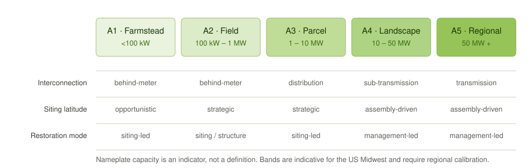
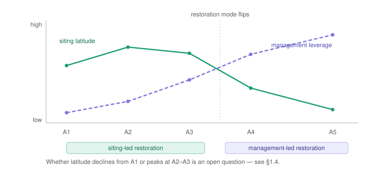

# 1. The Scale Transect {#sec-transect}

### 1.1 Why scale, and why a transect rather than bins {#sec-transect-why}

The New Urbanism Transect works because it is not one variable. It is a **bundle of covarying attributes** — density, frontage, thoroughfare character, landscape formality — moving together along one gradient, so naming a zone tells you many things at once.

Agroenergy scale behaves identically, and the literature confirms that capacity alone is a poor definition. Utility-scale solar is defined by its **role in the power system**, not by any universal threshold: SEIA puts the line above 1 MW, NREL uses 5 MW, and New York's permitting regime designates 25 MW+ as major renewable energy facilities. Community solar confounds it further, interconnecting in front of the meter at sizes exceeding distributed generation while still falling under net metering.

So the transect is defined by covarying bundles, with nameplate capacity as an **indicator, not a definition**. The attributes that move together:

- Interconnection posture (behind-meter → distribution → transmission)
- Decision-making unit (single landowner → multi-party → utility/IPP with queue position)
- Permitting burden (by-right → site plan review → full environmental review)
- [Ground-layer](5-general-terminology.qmd#term-ground-layer) management mode (existing farm labor → purpose-built → contract enterprise)
- Capital structure (owner-financed → tax equity and offtake → project finance)
- Community interface (neighbors → township → regional stakeholder process)
- **Siting latitude** (opportunistic → strategic → constrained by land assembly and grid topology)

**The physics scales too.** The transect is not only an institutional gradient; the [agrivoltaic](5-general-terminology.qmd#term-agrivoltaics) microclimate benefit is itself geometry- and scale-dependent. Soil-temperature reduction and moisture retention are broadly consistent across systems, but air-temperature effects are variable and site-specific, and a meta-analysis of design tipping points [@zhang2025] reports a system-size threshold beyond which the net temperature effect reverses from cooling toward warming — evidence that scale changes the physical design problem, not just the ownership-and-permitting one.

> *Needs verification.* The specific size threshold (~2 ha, taken here from secondary summaries of @zhang2025) has not been confirmed against the primary text and should be read there before it is quoted.

### 1.2 The Zones {#sec-zones}

**A1–A5**, notation deliberately echoing T1–T6 so practitioners fluent in transect codes read it instantly.

| Zone | Indicative capacity | Interconnection | Decision unit | Ground-layer management |
|---|---|---|---|---|
| **A1 — Farmstead** | <100 kW | Behind-the-meter, net metered | Single owner-operator | Existing farm labor and equipment |
| **A2 — Field** | 100 kW–1 MW | Behind-meter to distribution | Landowner, possibly one lease counterparty | Existing equipment, modest adaptation |
| **A3 — Parcel** | 1–10 MW | Distribution; community solar, mid-market PPA | Multi-party: landowner, developer, offtaker, tax equity | Purpose-built: dedicated mowing, contract grazing, seeded establishment |
| **A4 — Landscape** | 10–50 MW | Distribution to sub-transmission; queue position matters | Developer-led, institutional capital | Contract enterprise: commercial graziers, habitat contracts |
| **A5 — Regional** | 50 MW+ | Transmission; merchant or utility PPA | Utility/IPP, multi-jurisdiction | Contract enterprise at ranch scale; multi-site rotation logistics |

{#fig-transect}

**Calibration note.** Capacity bands are indicative for the US Midwest and should be re-calibrated regionally. The zone is defined by the attribute bundle, not the megawatts.

### 1.3 Why the transect earns its place {#sec-grazing}

Take one ground-layer function — **sheep grazing** — across the zones. The literature shows it is not one practice:

- **A1–A2:** the farmer's own flock. The array is a shade and forage-timing modification to an existing operation. Stocking here is a design variable to calibrate rather than a fixed rate — instantaneous **stocking density** (animals per unit area at a moment) and season-long **carrying capacity** (what the forage sustains over time) diverge with forage growth, utilization, and climate, so any single figure is a single-site, single-season result. Penn State Extension reports New York and Michigan experience converging on roughly 3 ewes/acre for mature ewes [@hartman2026], while rotational trials on the Cornell array have tested densities from 4 to 20 sheep/acre.
- **A3:** grazing becomes a contracted service. New York distributed solar (1–20 MW on 6–120 acres) is where vegetation-management contracts appear, paying roughly $300–500/acre/year. Design must now accommodate a party who does not live there.
- **A4–A5:** grazing is a logistics enterprise. @mccall2023 report median per-activity vegetation-management costs across 54 utility-scale sites: mowing ran about $113/acre/yr at sheep-grazing sites, $121 at native-vegetation sites, and $203 at turfgrass sites, while herbicide application was highest on gravel at $293/acre/yr. The design questions at this zone become flock rotation across non-contiguous parcels, water access, and fence-gate topology — none of which exist as design problems at A1.

**The more important finding from the same study is a caution, not an endorsement.** While per-activity costs at native and pollinator-friendly ground covers were *lower* than at turfgrass, total combined vegetation O&M was slightly *higher*, because more separate activities are required through the first three to five years of establishment. [Restorative](5-general-terminology.qmd#term-restorative) ground cover is not cheaper from day one; it is more expensive during establishment and competitive afterward. Any argument for restorative practice that leads with cost savings should expect to meet an operator who has seen the establishment-phase invoices.

> *Citation caution.* These figures circulate widely in secondary sources with the activity labels transposed — the mowing cost incurred *at* grazing sites is frequently reported as the cost *of* grazing, and per-acre figures are converted to per-hectare without relabeling. A concrete, good-faith instance: @stewart2025 report McCall's $279/ha/yr (= $113/acre/yr) as "the median cost for sheep grazing," where in McCall's Table 4 that number is the median *mowing* cost at sheep-grazed sites — the grazing activity itself ran a median of about $50/acre/yr. The two readings coexist in the primary literature and the per-hectare conversion compounds the ambiguity; McCall's own Table 4 is the arbiter, so practitioners quoting these figures should go to @mccall2023 directly.

Same term. Three different design problems. That is the work the transect does.

### 1.4 Siting latitude and the restoration mode shift {#sec-siting-latitude}

A further attribute deserves its own treatment, because it governs *which restorative levers are available at all*.

**Siting latitude** is the designer's freedom over where the array goes. What governs that choice migrates as one climbs the transect:

| Zone | What governs siting | Locus of control |
|---|---|---|
| **A1–A2** | Opportunistic — spare corners, awkward field ends, ground already idle | The operator |
| **A3** | Strategic — consistently low-yielding ground, hydrologic features, buffer geometry | Developer and landowner in deliberate concert |
| **A4–A5** | Land assembly — contiguous acreage, substation proximity, queue position; modified at the margins by prime-farmland rules, opposition mapping, and community targeting | The land market and grid topology, mediated by policy veto points |

This scale-dependence of *what governs siting* is a through-line of the agroenergy literature: at the farmstead, profit and opportunism; at the community scale, the distribution of benefit and the risk of opposition; at the regional scale, energy demand and grid topology; at the state and national scale, policy. The transect encodes that migration as a single gradient rather than four separate conversations.

**The consequence: restoration changes mode rather than simply diminishing.** As siting latitude falls, the burden of delivering co-benefit shifts from *where the array is placed* to *how it is run*. Management leverage moves the opposite way — contract grazing, professional habitat establishment, and dedicated O&M are unavailable below a size threshold and routine above it. A forty-acre owner cannot profitably retain a contract grazier; a thousand-acre site can, and gets seeded establishment and monitoring besides.

The two therefore cross somewhere between A3 and A4. This yields three restoration modes:

- **Siting-led** — the restorative work is done by the choice of ground. Requires A2–A3 latitude.
- **Structure-led** — array geometry is the instrument: clearance, row spacing, module transmissivity.
- **Management-led** — placement is a given; ground cover, grazing regime, and operational schedule carry everything.

{#fig-siting}

This explains a pattern visible across the literature but rarely named: utility-scale restorative practice is overwhelmingly about ground cover and grazing, while small and mid-scale discourse is overwhelmingly about placement. These are not competing fashions. They are the only levers available at each end of the transect.

*Open question (see §7).* Whether siting latitude declines monotonically or peaks in the middle. The case for a peak: at A1 the binding constraint is the parcel boundary, so the operator has very little ground to choose among even though the array is small. Opportunistic placement is real but is not the same thing as strategic latitude, and the lexicon should decide which it means.

### Associated Terminology

Terms this section introduces. Each is defined above; this block is their collection point.

- **Scale Transect** — A single gradient from farmstead (A1) to regional (A5) that most other terms are read against; defined by covarying attribute bundles rather than capacity thresholds.
- **Covarying attribute bundle** — The set of attributes (interconnection, decision unit, permitting, management mode, capital, community interface, siting latitude) that move together along the transect, so naming a zone tells you many things at once; nameplate capacity is an indicator, not a definition.
- **A1 — Farmstead** — <100 kW, behind-the-meter, single owner-operator on existing farm labour and equipment.
- **A2 — Field** — 100 kW–1 MW, behind-meter to distribution, landowner with possibly one lease counterparty.
- **A3 — Parcel** — 1–10 MW, distribution / community solar / mid-market PPA, multi-party, purpose-built ground management.
- **A4 — Landscape** — 10–50 MW, developer-led institutional capital, contract-enterprise management.
- **A5 — Regional** — 50 MW+, transmission, utility/IPP across jurisdictions, contract enterprise at ranch scale.
- **Siting latitude** — The designer's freedom over where the array goes; what governs it migrates from opportunistic placement to land assembly and grid topology up the transect.
- **Restoration mode** — Whether restorative work is delivered by choice of ground (**Siting-led**), array geometry (**Structure-led**), or operation (**Management-led**); the mode shifts as siting latitude falls up the transect.
- **Stocking density** — Instantaneous animals per unit area at a moment; diverges from carrying capacity with forage growth, utilization, and climate.
- **Carrying capacity** — Season-long forage the land sustains over time; a grazing design variable distinct from instantaneous stocking density.
- **Contract grazing** — Grazing delivered as a contracted vegetation-management service by a party who does not live on site; appears at A3 and scales up as a logistics enterprise.

---
