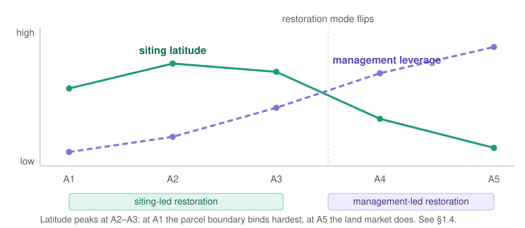

# 1. The Scale Transect {#sec-transect}

### 1.1 A gradient, not a set of size bins {#sec-transect-why}

A 30-kilowatt barn array and a 300-megawatt regional project are both solar on farmland, but their decision-makers, finance, grid connection, ground management, and possible land functions differ. **Scale** is therefore a transect: a gradient of attributes that change together, rather than a set of capacity bins. Capacity is a useful hint, not the definition. What moves together is:

- **How it connects to the grid**: behind the meter → distribution → transmission
- **Who decides**: one landowner → several parties at a table → a utility with a place in the interconnection queue
- **What it takes to permit**: allowed by right → site plan review → full environmental review
- **Who manages the ground**: existing farm labor → purpose-built for the site → an outside contractor
- **Where the money comes from**: the owner's pocket → tax equity and a power contract → project finance
- **Who has to be talked to**: the neighbors → the township → a regional process
- **[Siting latitude](#sec-siting-latitude)**: opportunistic → strategic → decided by what land could be assembled near a substation

Physical effects change with geometry and scale as well. Soil cooling and moisture retention are more consistent than air-temperature effects, which vary by site [@zhang2025].

### 1.2 The Zones {#sec-zones}

**A1–A5** are five zones along the gradient, with a zero-land case (A0) at its origin.

::: {.zone-table}
| Zone | Indicative capacity | Indicative footprint | Interconnection | Decision unit | Ground-layer management |
|---|---|---|---|---|---|
| **A1 — Farmstead** | <100 kW | under ~1 acre | Behind-the-meter, net metered | Single owner-operator | Existing farm labor and equipment |
| **A2 — Field** | 100 kW–1 MW | ~0.5–8 acres | Behind-meter to distribution | Landowner, possibly one lease counterparty | Existing equipment, modest adaptation |
| **A3 — Parcel** | 1–10 MW | ~5–80 acres | Distribution; community solar, mid-market PPA | Multi-party: landowner, developer, offtaker, tax equity | Purpose-built: dedicated mowing, contract grazing, seeded establishment |
| **A4 — Landscape** | 10–50 MW | ~60–400 acres | Distribution to sub-transmission; queue position matters | Developer-led, institutional capital | Contract enterprise: commercial graziers, habitat contracts |
| **A5 — Regional** | 50 MW+ | ~300 acres to 10,000+ | Transmission; merchant or utility PPA | Utility/IPP, multi-jurisdiction | Contract enterprise at ranch scale; multi-site rotation logistics |
:::

Capacity is how a project is filed; acreage is how landholders and communities experience it. Trackers and agrivoltaic clearance use more land per megawatt than dense arrays, so **acreage is the better guide when the two disagree** [@gallaher2026; @sturchio2025croplands].

Building-mounted arrays are **A0**: no ground to choose, manage, share, or spare. A5 has no ceiling; its common condition is placement fixed by land assembly and restoration carried by management (§8, issue 1).

{#fig-transect}

These indicative bands fit the US Midwest and should be redrawn elsewhere. Not every zone exists in every region.

### 1.3 One practice, three design problems {#sec-grazing}

Follow sheep grazing up the transect and one job becomes three. Sheep generally fit standard racking; goats, cattle, and horses often do not [@merheb2025].

- **A1–A2, the farmer's own flock.** The array modifies an existing operation. Stocking density and carrying capacity must be calibrated to forage and weather, not taken from a universal rate.
- **A3, grazing as a hired service.** The design must work for a grazier who does not live on site.
- **A4–A5, grazing as logistics.** Water, gates, travel, and multi-site rotation become central.

Native and pollinator-friendly covers can cost more during establishment even where later operations compare well with turf [@mccall2023]. Quote grazing-cost figures from the primary table: secondary sources often confuse mowing at grazing sites with the cost of grazing itself.

“Solar grazing” without a zone can mean three different practices.

### 1.4 Siting latitude and the restoration mode shift {#sec-siting-latitude}

One item in that list decides which restorative moves are available at all: **siting latitude**, the freedom to choose where the array goes. What controls it changes as projects get bigger.

| Zone | What decides where it goes | Who actually chooses |
|---|---|---|
| **A1** | The yard, the herd, and the existing service drop | The operator, with almost no ground to choose among |
| **A2** | Spare corners, awkward field ends, ground already sitting idle | The operator |
| **A3** | Consistently low-yielding ground, where the water runs, buffer geometry | Developer and landowner, deliberately, together |
| **A4–A5** | Contiguous acreage near a substation and a place in the queue, nudged at the edges by prime-farmland rules, likely opposition, and which communities benefit | The land market and the grid, filtered through policy veto points |

As projects grow, restoration changes instrument. Siting latitude falls while management capacity rises, crossing around A3–A4:

- **Siting-led**, where the work is done by choosing the ground. Needs A2–A3 freedom.
- **Structure-led**, where the hardware does it: clearance, row spacing, how much light the modules let through.
- **Management-led**, where placement is fixed and ground cover, grazing, and operation carry everything.

{#fig-siting}

At utility scale, restorative practice is mainly ground cover and grazing; at small and mid scale it is mainly placement [@macknick2022; @boggis2020]. Latitude peaks at A2–A3, bounded by the property line at A1 and land assembly and grid access at A5. That is why siting-led forms such as [solar prairie strips](6-archetypes.qmd#arch-prairie-strips) and [marginal land solar](6-archetypes.qmd#arch-marginal) live in the middle zones.

### Terms

Terms introduced in this section are defined in the [Terminology](5-terminology.qmd) chapter (§5), under [Scale](5-terminology.qmd#sec-terms-scale), alongside every other term the document defines.

---
