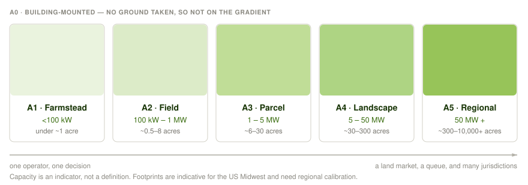

# 1. The Scale Transect {#sec-transect}

### 1.1 A gradient, not a set of size bins {#sec-transect-why}

A 30-kilowatt barn array and a 300-megawatt regional project are both solar on farmland, but their decision-makers, finance, grid connection, ground management, and possible land functions differ. **Scale** is therefore a transect: a gradient of attributes that change together, rather than a set of capacity bins. Capacity is a useful hint, not the definition. What moves together is:

- **How it connects to the grid**: behind the meter → distribution → transmission
- **Who decides**: one landowner → several parties at a table → a utility with a place in the interconnection queue
- **What it takes to permit**: allowed by right → site plan review → full environmental review
- **Who manages the ground**: existing farm labor → purpose-built for the site → an outside contractor
- **Where the money comes from**: the owner's pocket → tax equity and a power contract → project finance
- **Who has to be talked to**: the neighbors → the township → a regional process
- **[Siting latitude](#sec-siting-latitude)**: opportunistic → strategic → decided by what land could be assembled near a substation

Physical effects change with geometry and scale as well. Soil cooling and moisture retention are more consistent than air-temperature effects, which vary by site [@zhang2025].

### 1.2 The Zones {#sec-zones}

::: {.zone-table}
| Zone | Indicative capacity | Indicative footprint | Interconnection | Decision unit | Ground-layer management |
|---|---|---|---|---|---|
| **A1 — Farmstead** | <100 kW | under ~1 acre | Behind-the-meter, net metered | Single owner-operator | Existing farm labor and equipment |
| **A2 — Field** | 100 kW–1 MW | ~0.5–8 acres | Behind-meter to distribution | Landowner, possibly one lease counterparty | Existing equipment, modest adaptation |
| **A3 — Parcel** | 1–10 MW | ~5–80 acres | Distribution; community solar, mid-market PPA | Multi-party: landowner, developer, offtaker, tax equity | Purpose-built: dedicated mowing, contract grazing, seeded establishment |
| **A4 — Landscape** | 10–50 MW | ~60–400 acres | Distribution to sub-transmission; queue position matters | Developer-led, institutional capital | Contract enterprise: commercial graziers, habitat contracts |
| **A5 — Regional** | 50 MW+ | ~300 acres to 10,000+ | Transmission; merchant or utility PPA | Utility/IPP, multi-jurisdiction | Contract enterprise at ranch scale; multi-site rotation logistics |
:::

Capacity is how a project is filed; acreage is how landholders and communities experience it. Trackers and agrivoltaic clearance use more land per megawatt than dense arrays, so **acreage is the better guide when the two disagree** [@gallaher2026; @sturchio2025croplands].

Building-mounted arrays are **A0**: no ground to choose, manage, share, or spare. A5 has no ceiling; its common condition is placement fixed by land assembly and restoration carried by management (§8, issue 1).

These indicative bands fit the US Midwest and should be redrawn elsewhere. Not every zone exists in every region.

:::: {#sec-grazing .example}
**A worked example: grazing across the transect.** Take one practice, sheep grazing, and follow it from the farmstead to the region. The name never changes. The job changes three times.

Sheep generally fit standard racking; goats climb it and chew wiring, and cattle and horses are too large for standard clearances [@merheb2025], so the animal is settled before the scale question comes up.

| Zone | Who grazes | Typical figures | The design problem |
|:--|:--|:--|:--|
| **A1–A2** | the farm's own flock | ~3 ewes/acre in New York and Michigan experience [@hartman2026]; 4–20 sheep/acre in rotational trials at Cornell | calibrating stocking to forage and weather rather than to a published rate |
| **A3** | a contracted grazier | ~$300–500/acre/yr for vegetation management | making the design work for someone who does not live there |
| **A4–A5** | a logistics enterprise | mowing medians across 54 utility-scale sites: $113/acre/yr at sheep-grazed sites, $121 at native-vegetation, $203 at turfgrass; herbicide $293 on gravel [@mccall2023] | water, gates, travel, and rotation between parcels that do not touch |

: Solar grazing across the transect. {#tbl-grazing}

**Stocking density** (animals on the ground at one moment) and **carrying capacity** (what the forage feeds across a season) come apart as growth, use, and weather vary, which is why the A1–A2 figures are a range and not a rate.

Establishment is the cost that surprises people. Per-activity costs at native and pollinator-friendly covers run *below* turfgrass, but total vegetation O&M came out slightly *higher*, because the first three to five years take more separate operations [@mccall2023]. Restorative ground cover is more expensive to establish and competitive afterward, so anyone arguing for it on cost savings should expect to meet an operator who has seen the establishment invoices.

“Solar grazing” without a zone can mean three different practices.
::::

::: {.caution}
**Citation caution.** The figures in the table above are widely misquoted with the activity labels transposed, reporting the mowing cost incurred *at* grazing sites as the cost *of* grazing. @stewart2025 give McCall's $279/ha/yr (= $113/acre/yr) as "the median cost for sheep grazing," where in McCall's Table 4 it is the median *mowing* cost at sheep-grazed sites; grazing itself ran about $50/acre/yr. Go to @mccall2023 directly.
:::

### 1.3 Siting latitude and the restoration mode shift {#sec-siting-latitude}

One item in that list decides which restorative moves are available at all: **siting latitude**, the freedom to choose where the array goes. What controls it changes as projects get bigger.

| Zone | What decides where it goes | Who actually chooses |
|---|---|---|
| **A1** | The yard, the herd, and the existing service drop | The operator, with almost no ground to choose among |
| **A2** | Spare corners, awkward field ends, ground already sitting idle | The operator |
| **A3** | Consistently low-yielding ground, where the water runs, buffer geometry | Developer and landowner, deliberately, together |
| **A4–A5** | Contiguous acreage near a substation and a place in the queue, nudged at the edges by prime-farmland rules, likely opposition, and which communities benefit | The land market and the grid, filtered through policy veto points |

As projects grow, restoration changes instrument. Siting latitude falls while management capacity rises, crossing around A3–A4:

- **Siting-led**, where the work is done by choosing the ground. Needs A2–A3 freedom.
- **Structure-led**, where the hardware does it: clearance, row spacing, how much light the modules let through.
- **Management-led**, where placement is fixed and ground cover, grazing, and operation carry everything.

![**Figure 1.2.** How the freedom to choose ground trades off against the ability to manage it. Siting latitude is how much say you have over where the array goes. It peaks in the middle of the transect: at A1 the property line leaves almost nothing to choose among, and at A5 the choice belongs to the land market and the interconnection queue. Management leverage runs the other way, because contract grazing, professional seeding, and dedicated maintenance barely exist below a certain size and are routine above it. The two cross between A3 and A4, and that crossing is where the instrument changes: below it you restore land by choosing which ground to take, above it by deciding how the ground is run. Restoration does not fall away with scale, it changes tool.](../figures/fig_siting_latitude.svg)

At utility scale, restorative practice is mainly ground cover and grazing; at small and mid scale it is mainly placement [@macknick2022; @boggis2020]. Latitude peaks at A2–A3, bounded by the property line at A1 and land assembly and grid access at A5. That is why siting-led forms such as [solar prairie strips](5-archetypes.qmd#arch-prairie-strips) and [marginal land solar](5-archetypes.qmd#arch-marginal) live in the middle zones.
