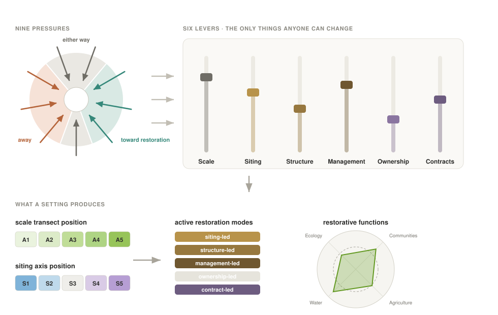
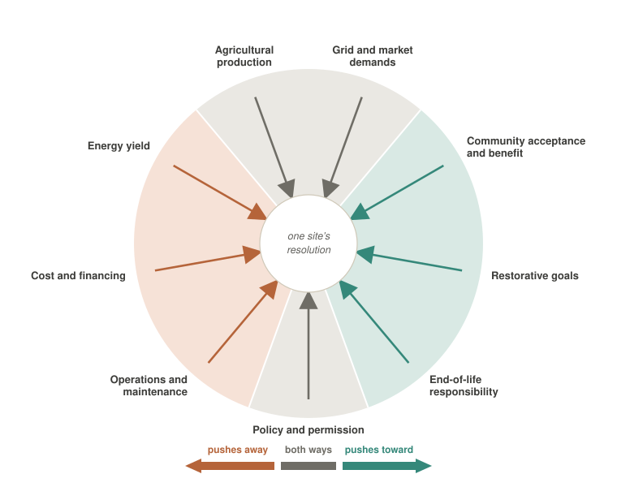

::: {.draft-note}
**Working draft, circulated for comment.** Some citations are
[not yet verified](chapters/sources.qmd) and are marked where they appear, and the
[open issues](chapters/8-open-issues.qmd) record what this document has deliberately
not settled.
:::

::: {.welcome}
Most people meet this subject through **agrivoltaics** — sheep grazing between the rows,
lettuce raised in the shade of a panel, the photograph that makes solar on farmland look like
an easy bargain. The picture is real, and it is rare. Crops grown directly under or between
panels account for something on the order of 2% of what has actually been built [@stid2022;
@macknick2022]. The rest is still solar on agricultural land, and it still decides where the
water goes, what lives in the soil, what the neighbors see from the road, and whether the farm
that held the ground is still farming in ten years.

**Agrisolar** is the wider word for all of it: solar generation on agricultural land, whatever
happens to production underneath. **Restorative agrisolar design** is a claim about that wider
category — that these arrays can be built so the land and the community around them are better
off for their presence, and that ecological, hydrological, and community function belong among
the objectives of the design rather than among its accidents. This document argues that claim
rather than assuming it, and gives it a vocabulary precise enough to be tested on real ground.
:::

## A shared language

A solar grazier, a township planner, a hydrologist, and a developer can stand on the same
eighty acres and describe it in four vocabularies that do not translate. Each of the four is a
real body of practice, built by people who know their part of the problem well — and each was
built separately, so the parts do not compose. Until the words line up, no one can tell whether
they actually disagree or are merely using terms differently, and the argument runs on words
instead of on ground.

There is no agrisolar design profession to write to, so this is addressed to the people who
actually make the decisions: farmers and landowners weighing what an array would do to an
operation, community decision-makers who have to judge a proposal on its merits, and solar
professionals who need to discuss land with both. It should read as rigorous to a landscape
architect, an agronomist, or a hydrologist; it is not written to them first. Where the precise
term and the recognizable one differ, this document takes the recognizable one and defines it
carefully.

None of this stays hypothetical for long. A net-zero grid by 2050 would put solar on
60,000–90,000 km² of land — roughly 1% of the contiguous United States, or a third of the
ground its cities now occupy [@larson2021] — and most of it will be farmland.

## How the language works

Three questions decide what a site becomes, and the document is built around them. **Scale**
settles what is possible before anyone draws anything. **Sharing and sparing** records what the
project costs the land, here and by consequence elsewhere. The **design pressures** are the
forces that bear on the decision and genuinely oppose one another. Together they resolve into a
recognizable form, which carries some restorative functions and not others.

### Scale

Scale comes first because it settles what is physically, economically, and institutionally
possible before design begins. The [scale transect](chapters/1-the-scale-transect.qmd) runs
from the farmstead to the region in five zones. It is a transect rather than a set of size bins
because several things move together along it: how a project connects to the grid, who decides,
what permitting it faces, and who manages the ground beneath the panels.

::: {.zone-table}
| Zone | Indicative footprint | What changes at this size |
|---|---|---|
| **A1 — Farmstead** | under ~1 acre | One owner-operator, existing farm labor, behind the meter |
| **A2 — Field** | ~0.5–8 acres | Still the landowner's decision, perhaps one lease counterparty |
| **A3 — Parcel** | ~5–80 acres | Multi-party; ground-layer management becomes a contract |
| **A4 — Landscape** | ~60–400 acres | Developer-led; grazing and habitat become enterprises |
| **A5 — Regional** | ~300 to 10,000+ acres | Transmission, institutional capital, many jurisdictions |
:::

A sixth case sits at the origin: arrays on buildings, which take no ground at all. Capacity is
given alongside acreage in [§1.2](chapters/1-the-scale-transect.qmd#sec-zones), but where the
two disagree, the land is the better guide to what the design problem will be.

### Sharing and sparing

The second question is what the array costs the land, and the accounting does not stop at the
fence. Ground kept in production here is ground that need not be broken somewhere else; ground
taken out of production here has to be made up elsewhere, or it goes unmade. That is the logic
the [sharing–sparing axis](chapters/2-the-sharingsparing-axis.qmd) borrows from conservation
ecology's land-sharing and land-sparing debate [@green2005; @phalan2011], where the underlying
question — farm gently everywhere, or intensively in some places and not at all in others —
remains genuinely unsettled. Five positions run from production continuing inside the array to
production ending on ground that was doing damage off-site.

::: {.position-table}
| Position | What it records |
|---|---|
| **S1 — Full sharing** | Production continues in the same ground, inside the footprint |
| **S2 — Functional sharing** | The ground layer is productive but subordinate — grazing, forage |
| **S3 — Coexistence** | *Neither.* Production stops on that ground, and the revenue sustains the farm enterprise that holds it |
| **S4 — Idled-land sparing** | The array takes ground already idle or marginal, sparing land that is not |
| **S5 — Impaired-land retirement** | Production ends on ground that was carrying a burden off-site |
:::

The center is the honest position, and it is where most projects sit. An ordinary array on
ordinary ground shares nothing and spares nothing: that field becomes a power plant. What can
still be restorative about it is the farm — where the lease is the margin that funds a
succession, retires a debt, or carries an operation through a bad decade, the project restores
the enterprise even though it restores nothing in the soil. A position records what happened to
the ground, never the merit of the project.

### Design pressures

Scale and position describe a site; neither explains why it was built that way. Eight
[design pressures](chapters/3-design-pressures.qmd) do that: generation yield, capital
discipline, operational simplicity, agricultural continuity, restorative ambition, social
license, offtake conformity, and decommissioning and reversibility. They are not axes. They have
direction, they conflict, and real people advocate for them, which is why the document names the
conflicts plainly rather than letting them surface as vague friction. It is also where the
document takes sides: restorative ambition sits on that list because the argument is that it
belongs there.

Everything after that is consequence. What a site is finally made to *do* forms a second
register — five [restorative functions](chapters/4-restorative-functions.qmd), reachable from
many structural positions at once, which is why they are a palette rather than a scorecard: no
good project delivers all five, and some work against each other. The recurring ways the three
questions settle are the [archetypes](chapters/6-archetypes.qmd), and naming the forces first is
what lets a fifth, a sixth, and a twentieth be described in the same language.

Two of those forms can have almost nothing physically in common. Solar prairie strips are bands
of restored prairie with panels standing among them, set where a field sheds its water: they end
production on the strip, but the strip was the ground doing the most damage downstream, and what
the farm buys is cleaner water and habitat. A small array over a barnyard shades the farm's own
cows and runs the milking parlor, and gives up generation at scale to do it. The same handful
of questions describes both, which is what makes it possible to say exactly where they differ —
and to hold either one against whatever is being proposed down the road from you.

::: {#sec-aim-not-dimensions}
The same eight pressures meet very different ground. Sun and cloud, aridity, the cropping
system, the grid operator, and whether the water beneath a field is being drawn down faster
than it returns all change how hard each pressure pushes, and so change how a site ought to
resolve. Shade that rescues a water-stressed crop in Arizona costs yield in Ohio. An argument
for retiring irrigated ground is decisive over a depleted aquifer and has nothing to act on in
a rain-fed county. [Regionality](chapters/7-regionality.qmd) works that through, and it is why
this document argues an aim rather than issuing dimensions: restoration is a response to a
particular place, and a fixed buffer width, a mandated seed mix, or a single success metric
would flatten the local reading the work depends on. **The aim is argued; the dimensions are
left to the site.**
:::

## Where to start

The chapters follow the order above, and the document is written to be read straight through.
Nothing requires that of you.

::: {.routes}
**If you have land in mind and want to know what is possible on it**, go to
[what appears at each scale](chapters/6-archetypes.qmd#sec-by-zone) — the forms that recur at
each size of project, from a barn roof to a regional complex, with what each one asks of the
ground.

**If you are weighing a specific proposal**, the
[design pressures](chapters/3-design-pressures.qmd) name the forces pulling on it and the
conflicts worth arguing about openly.

**If you are trying to pin down a term** someone has used, the
[alphabetical index](chapters/index-alphabetical.qmd) lists everything this document defines,
and the search box at the top of every page finds the rest.

**If you want to know what is still unsettled**, the
[open issues](chapters/8-open-issues.qmd) record the questions this document has deliberately
left open, and [sources](chapters/sources.qmd) separates what has been verified from what has
not.
:::

## Joining in

This is a working document, and it improves by being disagreed with. Corrections,
counterexamples, and proposed terms are welcome as issues or pull requests on
[GitHub](https://github.com/MSUHydrogeology/agrisolar_lexicon) — an archetype that recurs in
your region and is missing here, a term that lands badly with the people who have to use it, or
a citation you can trace further than we have.
